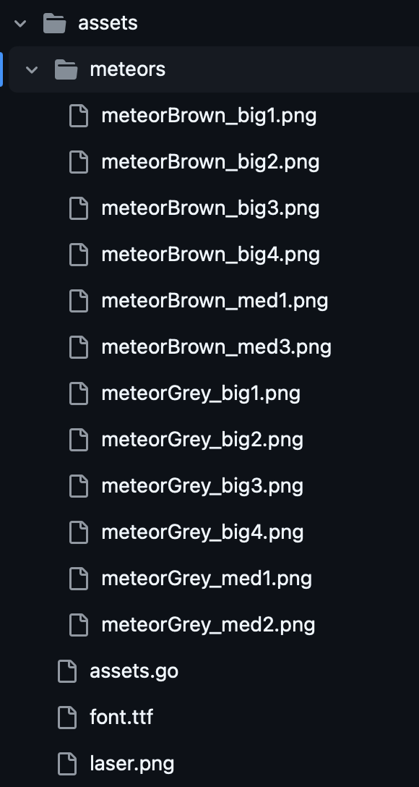

[](https://pkg.go.dev/github.com/temidaradev/esset)

# Esset

Esset, ebitengine için bast bir asset yükleyici.

# Kullanım

Önce `go get github.com/temidaradev/esset` ile go modülünüze ekleyin. Eğer yoksa bir asset klasörü oluşturun. Klasörü oluşturduktan sonra .png varlıklarını bu klasöre koyun ve `assets.go` dosyasını oluşturun. Bundan sonra

```
//go:embed *
var asset embed.FS
```

bu embed ifadesini içe aktarma kısmından sonra ekleyin. Artık esset'i asset yükleyici olarak kullanabilirsiniz. Sizden öncelikle embed ifadesi ve ardından `"asset.png"` olmak üzere 2 parametre ister.

## GetAsset

İşte bir örnek: `var Idle = esset.GetAsset(assets, "path/to/your/asset.png")`

## GetMultipleAssets

Önemli olan bir klasör oluşturmak ve her bir tile öğesini (.png) şu şekilde koymaktır



ve sonra bu işlevi şu şekilde kolayca kullanabilirsiniz: `var Tile = esset.GetMultipleAssets(assets, "path/to/your/*.png")` 1'den fazla resim seçtiğiniz için `*ebiten.Image`'imiz şu şekilde dizine göre seçebileceğiniz bir slice'dır: `TileComponent := asset.Tile[0]` veya bu klasörden rastgele bir varlık almanız gerekiyorsa şu şekilde yapabilirsiniz: `TileRandom := asset.Tile[rand.Intn(len(assets.Tile))]`

## DrawText

Yazı tipleri için yazı tiplerini ayrı ayrı gömmeniz gerekir:

```
//go:embed font/OpenSans-Medium.ttf
var MyFont []byte
```

Bunun için ayrı bir DrawOptions oluşturmaya gerek yok. Font büyüklüğünden sonra X ve Y ekleyin. Son olarak renginizi ekleyin.

Bundan sonra `esset.DrawText` fonksiyonunu şu şekilde kullanabilirsiniz: `esset.DrawText(screen, asset.MyFont, "naber", 24, 100, 50, color.White)`

Çok teşekkürler Kaynak desteği için [@m110](https://github.com/m110) <3
